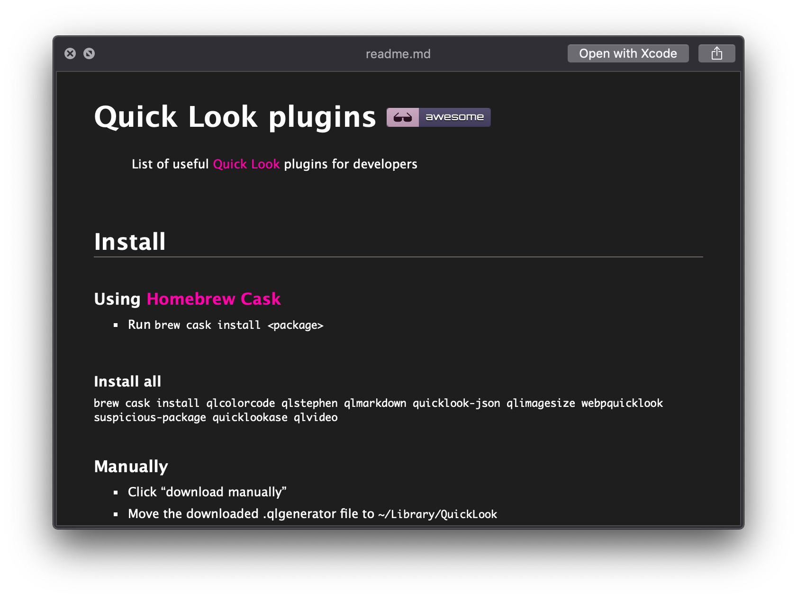
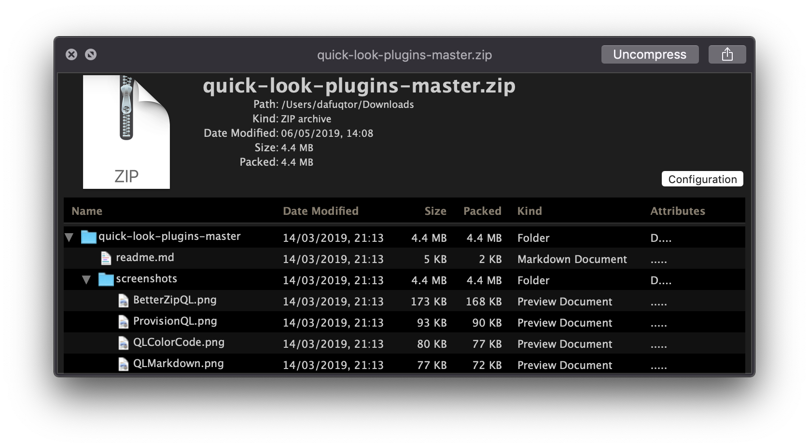
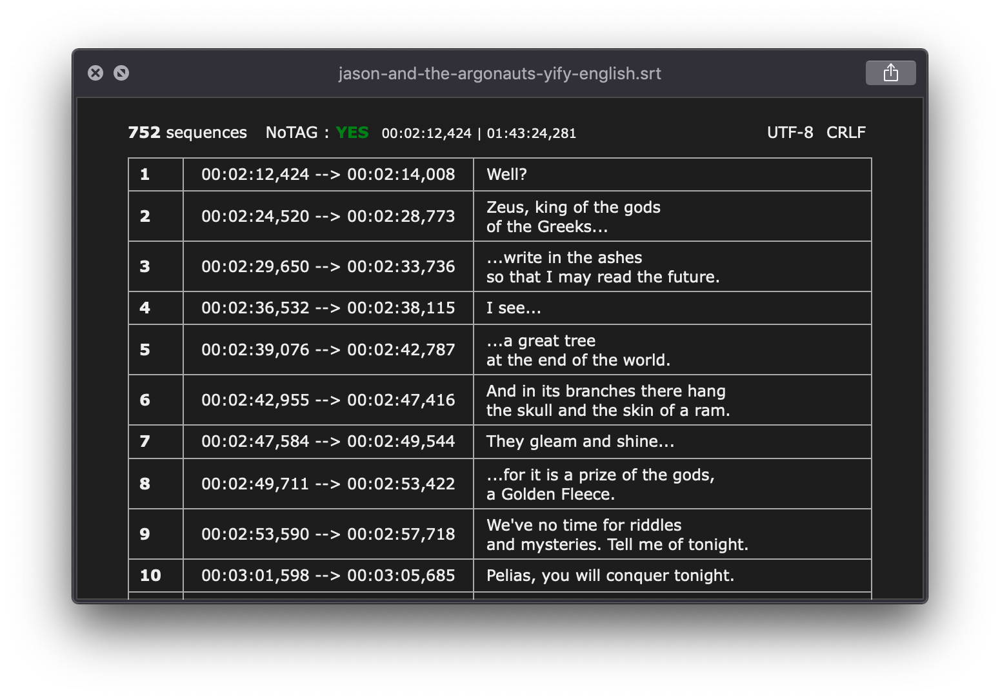

# Quick Look dark

> Dark themes for [Quick Look](http://en.wikipedia.org/wiki/Quick_Look) plugins

This repository suits your needs better if you have read this [List of useful Quick Look plugins for developers](https://github.com/sindresorhus/quick-look-plugins) by Sindre Sorhus


## Install (manually only)

#### After moving the downloaded .qlgenerator file to `~/Library/QuickLook` and running `qlmanage -r`
- Open `<plugin_name>.qlgenerator/Contents/Resources/`
- Replace `.css`, `.html` etc. file named below each plugin in this guide with proper `<plugin_name>-dark.<ext>`, naming it exactly like the original file


## Plugins


## [QLMarkdown](https://github.com/toland/qlmarkdown)

> Preview Markdown files

- File to replace — `styles.css`

Dark mode file - `QLMarkdown-dark.css`

[](https://github.com/toland/qlmarkdown)


## [BetterZipQL](https://macitbetter.com/downloads/)

> Preview archives

- File to replace — `index.html` with `BetterZipQL-dark.html`

[](https://macitbetter.com/downloads/)


## [QLAddict](https://github.com/tattali/QLAddict)

> Preview subtitles

~~- File to replace - `dark.css`~~

- Place `QLAddict-dark.css` in `themes/` folder, naming it like you want, e.g. `dark.css`

Run ```defaults write com.sub.QLAddict theme NAME_OF_THEME```

[](https://github.com/tattali/QLAddict)
